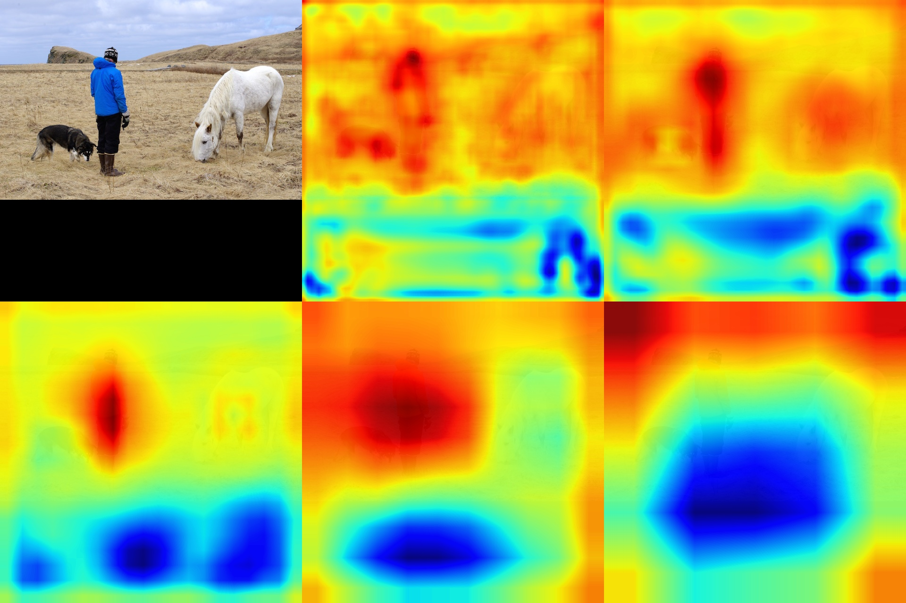

# EfficientDet
This is an implementation of GRADCAM for the [EfficientDet](https://arxiv.org/pdf/1911.09070.pdf) implementation by https://github.com/xuannianz/EfficientDet. This modifies the code written by fchollet in https://keras.io/examples/vision/grad_cam. This can help look at the areas that are getting activated in the various layers to help debug issues.  

## About pretrained weights
* The pretrained EfficientNet weights on imagenet are downloaded from [Callidior/keras-applications/releases](https://github.com/Callidior/keras-applications/releases)
* The pretrained EfficientDet weights on coco are converted from the official release [google/automl](https://github.com/google/automl).

Thanks for their hard work.
This project is released under the Apache License. Please take their licenses into consideration too when use this project.

## Build 
Run 'pip install -r requirements.txt' to install the project requirements.
Then run 'python setup.py build_ext --inplace'

## Test
`python3 efficientdet_visualize.py --model-path <path to pretrained h5 files> --phi <0-6> --viz-cls <class from coco to visualize on image> --img-path <input image path>, ` to test your image by specifying image path and model path there. 

 
